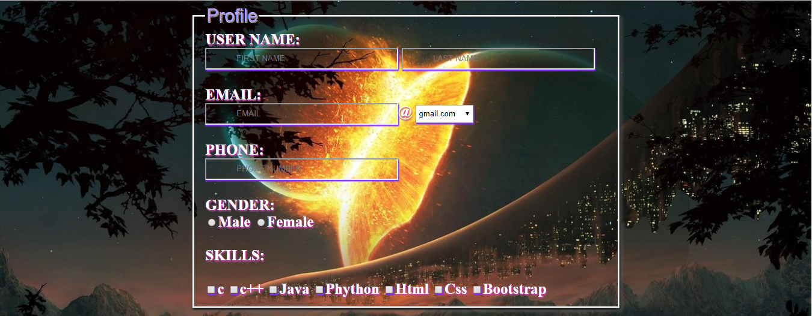
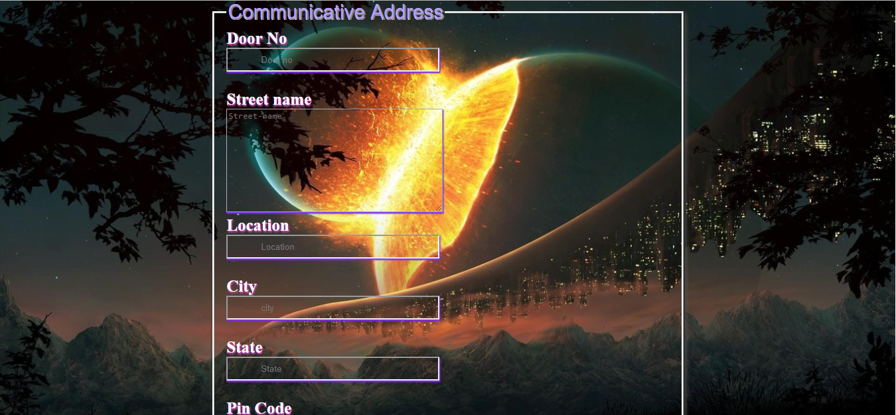
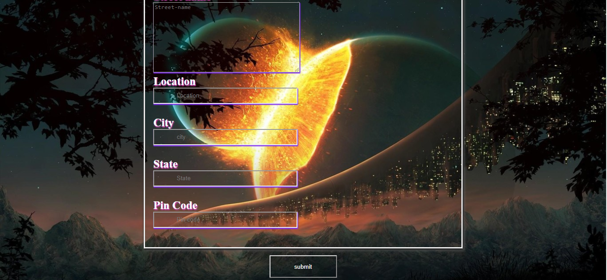

# TransparentForm
    Hello! Geeky This is my simple mini project . This project uses a common technology such as html and css .
	This project explains a form which has a transparency styling.
	
###Test Link

<a href="https://ajaykce.github.io/tr/">Click here</a>

## Sceenshot

